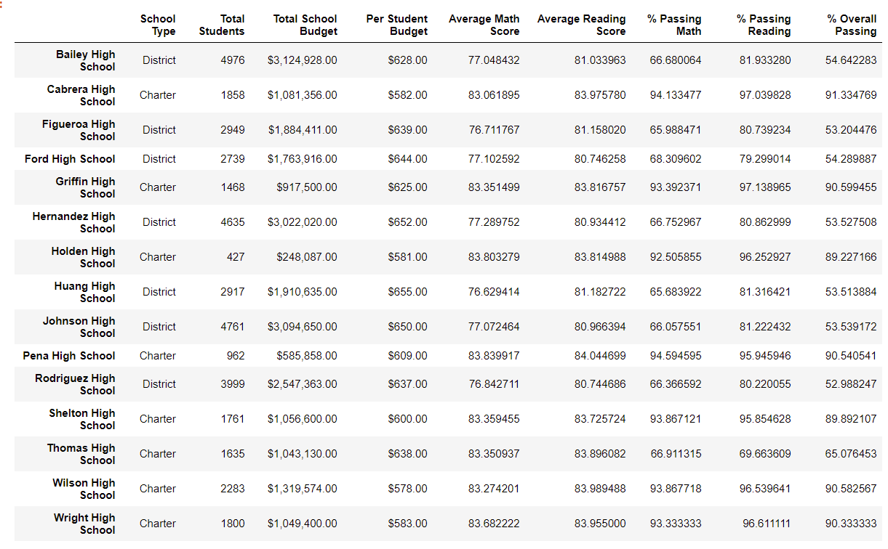
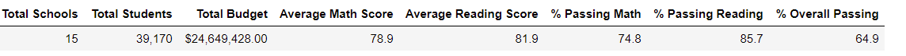

# School_District_Analysis
Data cleaning and School District testing analysis.

## Summary
The purpose of the project is to evaluate data for the school board. Evidence shows that certain classes may have cheated, and our goal with the project is to alter and evaluate data while keeping non-cheating parties' data intact.

### Background
The data in "schools_complete.csv", "students_complete.csv" found in the "Resources" folder, was given to us to perform our analysis on. 

#### Resources

Data input files:
- schools_complete.csv 
- students_complete.csv

The technology used here were the following:

Python 3.7.6
Jupyter Notebooks

## Results
During our analysis, we discovered the following trends in our data:

- <strong>District Summary</strong>: Based on the district data, 

- <strong>School Summary</strong>:

- <strong>Replacing Ninth Graders at Thomas High School</strong>:

### The Effects of Replacing Ninth-Grade Scores

## Analysis

## Conclusions